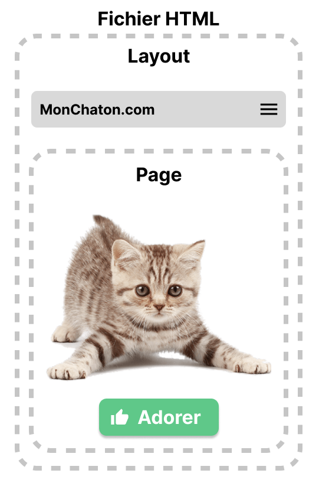

# TP2 OMD · Kitten Editor
## Made by Mael KERICHARD & Romain BRIEND in Rennes

- Version 1 du projet : [version 1/README.md](version 1/README.md)
- Version 2 du projet : [version 2/README.md](version 2/README.md)
    - La version 2 est hébergée ici: https://tp2-omd.mael.app

## Pourquoi faire une application web ?

Le web est un support très confortable qui nous permet d'exprimer notre créativité très facilement.
Il est aussi très facile de partager nos créations avec d'autres personnes.
Nous avons aussi fait ce choix afin de pouvoir utiliser ce qui existe déjà pour réaliser notre frontend.
C'est pour cela que nous avons utilisé un div avec un content_editable pour la zone de texte ainsi que la selection du navigateur.

## Description du workspace

Cette application web a été réalisée en utilisant le framework frontend SvelteKit.
Les fichiers de configuration sont à la racine et l'essentiel du projet se trouve dans le repertoire src.

Dans src, nous avons :
- routes/ : contient les pages de l'application
  - +page.svelte : contient le code de la page principal
  - +layout.svelte : contient le code du layout de la page



- lib/ : contient les composants visuels et assets de l'application
- classes/ : contient les classes utilisées dans l'application
- app.html : contient le template de l'application
- app.postcss : contient les styles de l'application (nous utilisons TailwindCSS)


## Developing

Once you've installed dependencies with `npm install` (or `pnpm install` or `yarn`), start a development server:

```bash
npm run dev

# or start the server and open the app in a new browser tab
npm run dev -- --open
```

## Building

To create a production version of your app:

```bash
npm run build
```

You can preview the production build with `npm run preview`.
