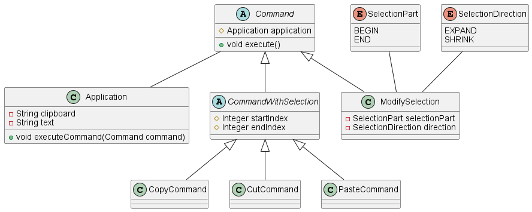

# Version 1

Dans cette version, nous avons implémenté les fonctionnalités suivantes :

- Copie de texte
- Collage de texte
- Couper du texte
- Manipulation de la sélection

## Copie

Nous utilisons un presse-papier global à l'application.
Lors de l'utilisation de la commande CTRL+C ou le bouton dans le ruban, le texte sélectionné est enregistré dans cette
variable.

## Collage

Lors de l'utilisation de la commande CTRL+V ou le bouton dans le ruban, le texte contenu dans la variable est collé à la
position du curseur.
Celui-ci est déplacé à la fin du texte collé.

## Couper

Lors de l'utilisation de la commande CTRL+X ou le bouton dans le ruban, le texte sélectionné est enregistré dans la
variable et supprimé du document.

## Manipulation de la sélection

La sélection est modifiable uniquement avec les commandes du ruban.
Il est néanmoins possible de la commencer en utilisant la souris.

# Diagramme de classes

Pour réaliser ce projet, nous sommes partis sur la conception d'un Command pattern. 

Ce pattern tourne autour de la classe abstraite "Command" qui possède une méthode "execute" qui va servir à éxectuer la commande en question.

Nous avons créé 4 classes commandes pour chaque fonctionnalité souhaitée : CopyCommand, CutCommand, PasteCommand et ModifySelection.
Une autre classe abstraite héritant de Command à été utilisé pour les commandes ayant besoin d'une séléction et donc d'une position de début et de fin pour s'appliquer. C'est le cas de la commande pour copier ou couper. La commande pour coller du texte fait aussi partis de ce cas-là, 
car nous avions besoin de savoir si une selection était écrasé par le texte collé. 

Nous avons ensuite un objet Application unique qui stocke le texte écris et le texte copié dans le presse-papier. C'est également l'application qui possède la méthode "executeCommand" qui va permettre d'éxécuter une commande.
Cette méthode est appelée soit par les boutons du ruban, soit par les raccourcis clavier.