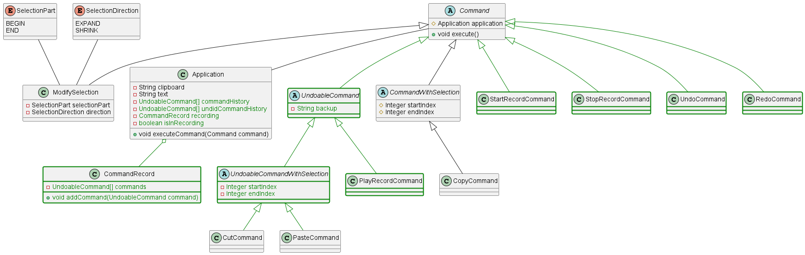
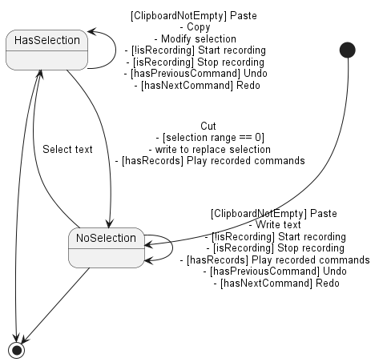

# Version 2

En plus des fonctionnalités de la version 1, nous avons implémenté les fonctionnalités suivantes :

- Annuler
- Rétablir
- Enregistrer une série d'actions

## Annuler

Les commandes de copie, de collage et de coupage sont annulables.

Ces commandes vont hériter d'une classe qui permet de différencier les actions que l'on peut annuler de celles que l'on
ne peut pas.

À l'exécution, elles seront ajoutées à un historique d'actions et l'état du document sera sauvegardé.
Lors de l'utilisation de la commande CTRL+Z ou le bouton dans le ruban, l'action précédente est annulée et l'état du
document lors de l'exécution de cette action est restauré.

Cette action annulée sera stockée dans un autre historique d'actions.

## Rétablir

Lors de l'utilisation du bouton dans le ruban, l'action précédemment annulée est rétablie. Pour ce faire, elle est
simplement exécutée à nouveau.

## Enregistrer une série d'actions

Lors de l'utilisation du bouton dans le ruban, l'utilisateur va pouvoir commencer un enregistrement d'une série
d'actions.
Les actions annulables seront enregistrées dans une liste.

Pour stopper l'enregistrement, l'utilisateur va devoir utiliser le bouton dans le ruban.

Lors de l'utilisation du bouton dans le ruban, l'utilisateur va pouvoir rejouer la série d'actions enregistrée, et cela,
autant de fois qu'il le souhaite. Jusqu'à vouloir enregistrer un nouvel enregistrement, ce qui va écraser l'ancien.

Lorsque l'on joue un enregistrement, les actions sont exécutées à l'endroit où elles ont été enregistrées.
# Diagramme de classes

Pour élaborer la version 2, nous avons repris notre diagramme de classe de la version 1 et nous avons apporté quelques modifications.

Premièrement, la classe Application s'est élargi pour pouvoir stocker les actions annulables et les actions rétablies ainsi que le système d'enregistrement de commandes et de replay.

Nous avons également ajouté une classe abstraite "UndoableCommand" qui hérite de la classe "Command". 
Cette classe abstraite permet de différencier les actions que l'on peut annuler de celles que l'on ne peut pas. Les commandes de collage et de coupage vont hériter de cette classe.

Les nouvelles fonctionnalités apportées par cette version sont implémentées sous forme de Command avec : StartRecordCommand, StopRecordCommand, PlayRecordCommand, UndoCommand et RedoCommand.
La commande PlayRecordCommand hérite de UndoableCommand car elle est annulable (annuler cette commande revient à annuler la totalité des commandes exécutées en jouant l'enregistrement).

# Diagramme d'états

Pour la version 2, on conserve les états de la précédente version. Chaque état a maintenant la possibilité d'enregistrer des commandes, de stopper l'enregistrement, d'annuler ou de rétablir une action.
On peut également jouer un enregistrement de commandes, si un texte est sélectionné, cette action fera basculer dans l'état "pas de sélection".